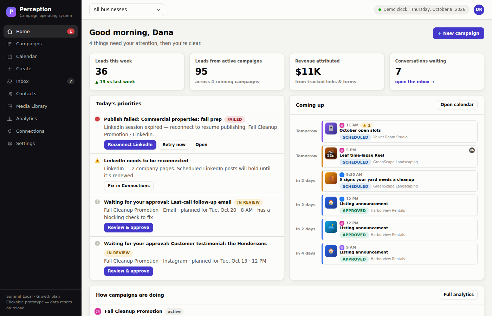
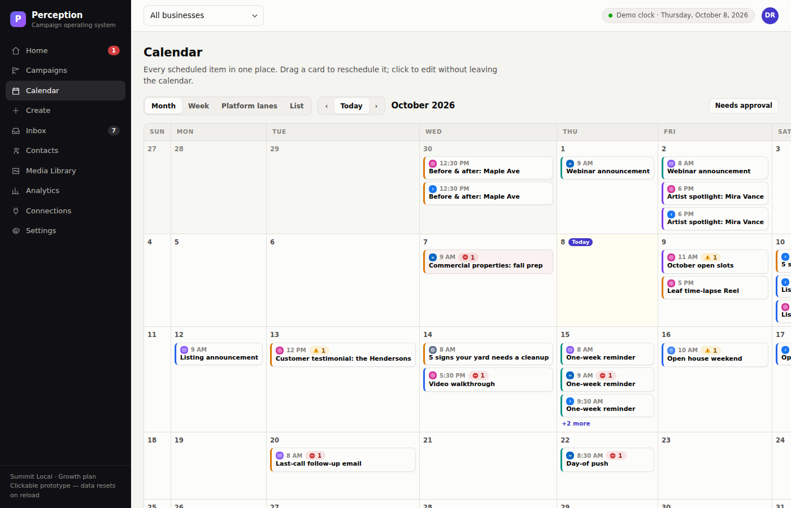
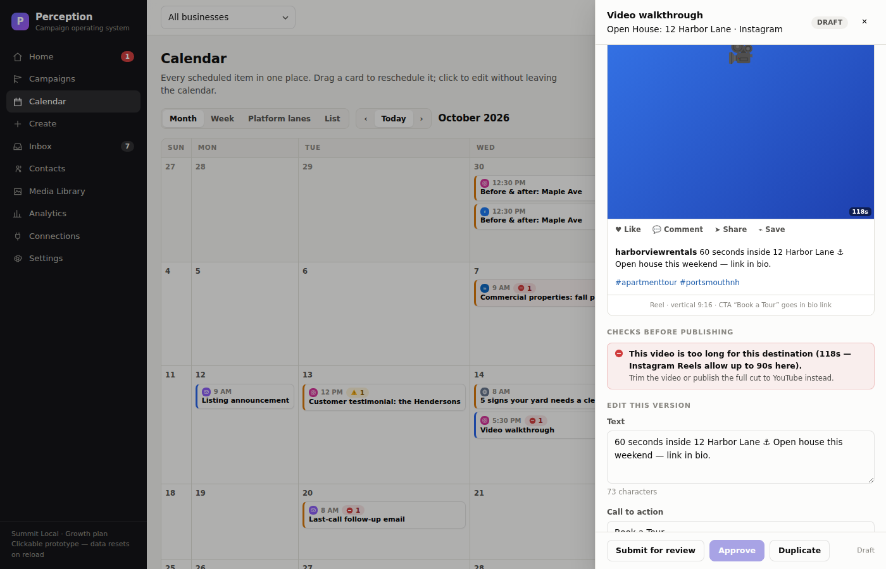
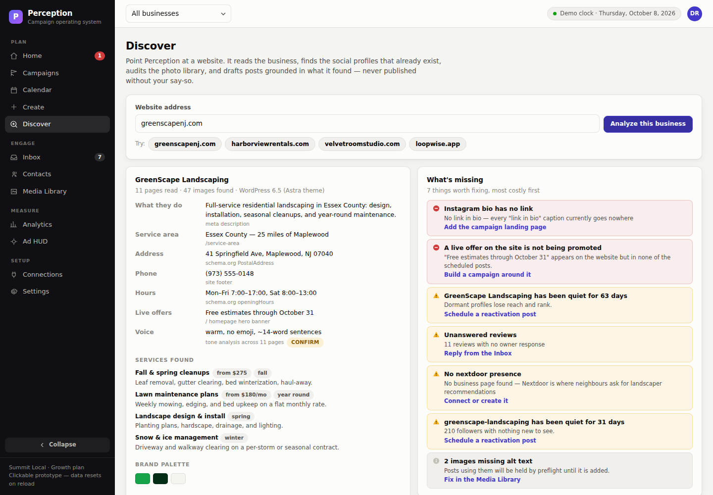
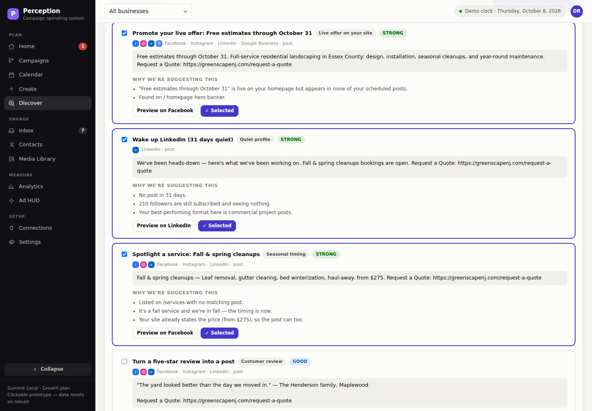
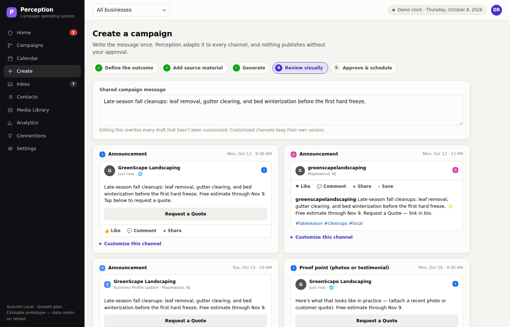
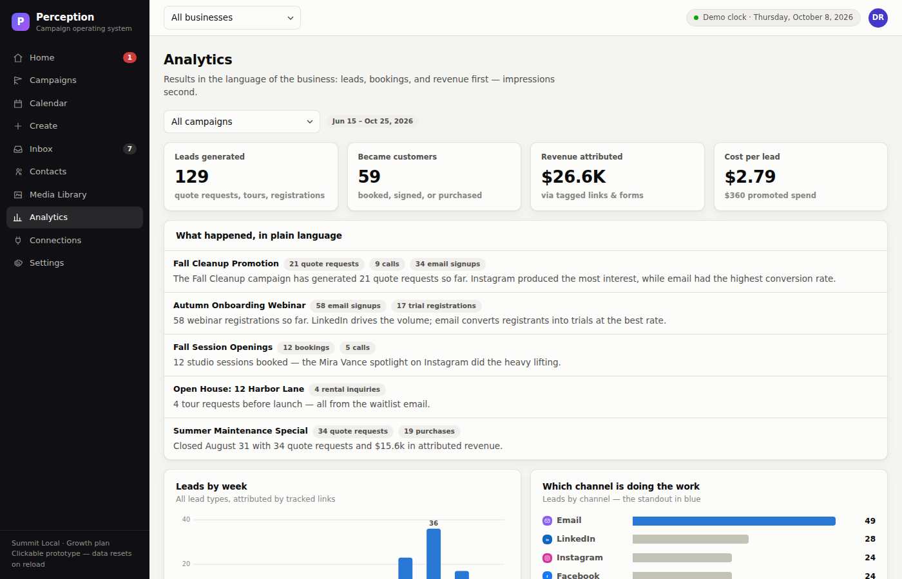
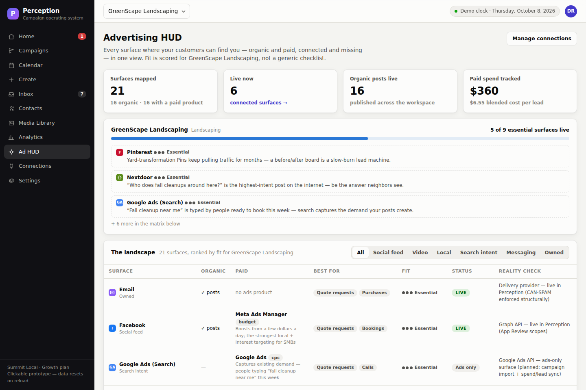

# Perception

**A campaign operating system for small businesses.**
One campaign, everywhere your customers are — plan social posts, email, and
website promotions from one simple calendar.

This repository contains the **clickable product design** and the
**prioritized MVP specification** for Perception: a fully navigable Next.js
prototype built on the real domain model, plus the production data model and
architecture documentation. It is the working blueprint the production
application gets built from — and it runs locally in about a minute with no
database, no API keys, and no accounts.



---

## Contents

- [What this repository is](#what-this-repository-is)
- [Quick start](#quick-start)
- [Commands](#commands)
- [Take the tour](#take-the-tour)
- [How it's built](#how-its-built)
- [Project structure](#project-structure)
- [What's real vs. simulated](#whats-real-vs-simulated)
- [From prototype to production](#from-prototype-to-production)
- [Troubleshooting](#troubleshooting)
- [Documentation](#documentation)
- [Product principles](#product-principles)

---

## What this repository is

Three deliverables in one place:

| Deliverable | What it is | Where |
|---|---|---|
| **Clickable product design** | Every screen of the product, navigable and interactive, running on the real domain model | `src/` |
| **MVP specification** | P0/P1/P2 priorities with acceptance criteria, delivery phases, and success metrics | `docs/MVP_SPEC.md` |
| **Production foundation** | The PostgreSQL data model, service architecture, publishing pipeline, and connector strategy | `prisma/`, `docs/` |

It is **not** the production application. Network I/O is simulated so the
whole product can be explored, tested with real small-business owners, and
argued about before a single platform integration is built. See
[What's real vs. simulated](#whats-real-vs-simulated).

---

## Quick start

### Prerequisites

| Requirement | Version | Notes |
|---|---|---|
| **Node.js** | 20 LTS or newer | Next.js 15 requires ≥ 18.18. Developed and tested on Node 22.x |
| **npm** | 10 or newer | Ships with Node 20+. pnpm/yarn/bun work too |

Check what you have:

```bash
node -v    # v20.x or newer
npm -v     # 10.x or newer
```

If you need Node, get it from [nodejs.org](https://nodejs.org) or via
[nvm](https://github.com/nvm-sh/nvm) (`nvm install 22 && nvm use 22`).

### Install and run

```bash
# 1. Get the code
git clone https://github.com/thecontentstudios/Perception.git
cd Perception

# 2. Install dependencies (~30s)
npm install

# 3. Start the development server
npm run dev
```

Open **<http://localhost:3000>** and you're in.

**No configuration is required.** There is no `.env` file to create, no
database to provision, no OAuth app to register. The prototype runs entirely
in the browser on an in-memory demo workspace.

### About the demo data

The demo clock is pinned to **Thursday, October 8, 2026**. That is
deliberate: it places the flagship example — the *Fall Cleanup Promotion*,
running September 15 to October 31 with 21 quote requests so far — live
mid-flight, so every state in the product has a real example on screen at
once:

- published posts with results behind them,
- scheduled work ahead of them,
- one failed publish waiting to be fixed,
- two items waiting for approval,
- and several safeguard warnings in different severities.

The workspace holds four businesses (a landscaper, a rental company, a
recording studio, and a software company) across five campaigns. Everything
you do — dragging cards, approving, reconnecting, generating a campaign —
updates live and **resets on page reload**, so you can demo the same story
repeatedly without cleanup.

---

## Commands

| Command | What it does |
|---|---|
| `npm run dev` | Development server with hot reload → <http://localhost:3000> |
| `npm run build` | Production build; fails on type errors |
| `npm start` | Serve the production build (run `build` first) |
| `npm run typecheck` | TypeScript check with no emit |

Before pushing, `npm run typecheck && npm run build` is the full gate — the
build type-checks and pre-renders every route, so a green build means every
page compiles and renders.

**Port already in use?** `npm run dev -- -p 3001`.

---

## Take the tour

Fifteen minutes, in this order. It follows the product's own logic: a problem
lands on Home, you fix it, then you plan the next campaign.

### 1. Home — what needs you today

Priorities first: a failed LinkedIn publish, a connection to renew, two
approvals waiting. Business results across the top — leads, revenue,
conversations — not impressions.

### 2. Connections → fix the failure

Click **Reconnect** on LinkedIn. Go back to **Home** and hit **Retry now** on
the failed post: it publishes, and the audit log in **Settings** records both
events. That round trip is the product's reliability promise in miniature —
a failure is never silent, and the fix is always one click from the problem.

### 3. Calendar — the heart of the product



Every card carries its thumbnail, campaign color, platform, time, status,
assignee, and warning count.

- Switch between **Month**, **Week**, **Platform lanes**, and **List**.
- **Drag any card to another day** to reschedule it.
- Open the **Unscheduled ideas** panel on the right and drag an idea onto a
  day.
- Try **List** view and bulk-approve several items at once.

Click any card to open the side-panel editor and work without leaving the
calendar. Open *Video walkthrough* (Oct 14) to see a blocking check in
action — a 118-second video on Instagram Reels, with **Approve** disabled
until it's resolved:



Other warnings worth finding: the missing unsubscribe footer on the last-call
email (Oct 20), the wrong image ratio on the studio post (Oct 9), and three
campaigns colliding on October 15.

### 3b. Discover — read a business, draft from what's there



Analyze `greenscapenj.com`. Perception reads the site, finds the social
profiles that already exist, audits the photo library, and drafts posts
grounded in all three — each one carrying **why** it's suggested, traced to
evidence:



Select a few and add them to the calendar as drafts. Full detail in
[`docs/DISCOVERY.md`](docs/DISCOVERY.md).

### 4. Create — the five-step composer



Walk all five steps: define the outcome → add source material → generate →
review → approve & schedule. Things to notice:

- Step 3 produces **drafts only**. Nothing is ever scheduled or published
  without you choosing it in step 5.
- Step 4 shows accurate per-destination previews. Edit the **shared campaign
  message** at the top and every draft updates — except ones you've
  customized, which keep their own version. That's the campaign/content
  item/channel variation split doing its job.
- Step 5 offers the three closes: schedule the recommended plan, choose dates
  manually, or save as a reusable template.

Finish with "Schedule the recommended plan" and you land on the calendar with
the new campaign in place.

### 5. Analytics — results in the owner's language



Outcomes first — quote requests, bookings, registrations, revenue, cost per
lead — then a plain-language sentence per campaign:

> The Fall Cleanup campaign has generated 21 quote requests. Instagram
> produced the most interest, while email had the highest conversion rate.

Charts are supporting evidence, and every charted value also appears in the
table below them.

### 6. Ad HUD — the whole advertising landscape at once



The Advertising & Social Understanding HUD maps **21 surfaces** — every
posting channel plus ads-only networks like Google Ads, Local Services Ads,
Microsoft Ads, and Yelp Ads — with organic and paid capability, cost models,
and an honest API reality-check per row. Fit is scored 0–3 **for your
industry**, not a generic checklist: filter to GreenScape Landscaping and
Nextdoor, Pinterest, and Local Services Ads surface as essential gaps with
one-line reasons; filter to Loopwise Software and X and Reddit rise instead.
Coverage meters show how many essential surfaces are live per business, and
the results panel shows what each surface is actually producing.

### Also worth a look

**Inbox** (comments, DMs, reviews, and email replies in one queue) ·
**Media Library** (alt text stored once, enforced everywhere) ·
**Campaigns** (per-campaign detail with tracked link and QR code) ·
**Settings** (roles, approval rules, and the audit log).

---

## How it's built

### The central idea, in code

A **Campaign** owns **ContentItems** (the message you write once), and each
content item owns **ChannelVariations** (the platform-specific adaptations).

```
Campaign  "Fall Cleanup Promotion"
└── ContentItem  "Cleanup announcement"        ← the shared message
    ├── ChannelVariation  Facebook  · post     ← published
    ├── ChannelVariation  Instagram · post     ← published, own hashtags
    ├── ChannelVariation  LinkedIn  · post     ← customized for B2B
    └── ChannelVariation  Google    · update   ← published
```

Keeping these three separate is what lets an owner edit the common message
while retaining specialized Instagram, LinkedIn, and email versions. It is
the single most load-bearing decision in the model — see `src/lib/types.ts`.

### The connector contract

Every destination — social platform, email, website — implements one
interface (`src/lib/connectors/contract.ts`):

```
connect · refreshAuth · listDestinations · validate · uploadMedia
publish · enqueue · edit? · remove? · getStatus · collectMetrics
pullEvents · normalizeError
```

Nine adapters implement it today, each carrying a real capability sheet
(formats, ratios, duration and character limits, native scheduling, edit and
delete support, and the platform-review constraints that gate go-live).
Adding a destination is a new adapter plus a registry entry — the campaign
system, calendar, safeguards, and workers don't change.

### The safeguard engine

`src/lib/preflight.ts` combines each adapter's channel-specific rules with
cross-cutting checks (connection health, promotion density, alt text, calls
to action, scheduling sanity) and returns human-readable warnings with
suggested fixes, ranked by severity. Blocking issues disable the approve and
schedule actions. Content a platform cannot accept is **never silently
dropped** — it surfaces here and holds.

---

## Project structure

```
src/
├── app/                      the ten product areas (Next.js App Router)
│   ├── page.tsx              Home — priorities, upcoming, results
│   ├── campaigns/            list + [id] detail
│   ├── calendar/             month · week · platform lanes · list
│   ├── create/               the five-step composer
│   ├── inbox/                unified conversations
│   ├── contacts/             contacts, segments, consent state
│   ├── media/                media library + alt-text management
│   ├── analytics/            outcome-first reporting
│   ├── hud/                  the Advertising & Social Understanding HUD
│   ├── connections/          connector status + capabilities
│   ├── settings/             team, roles, approval rules, audit log
│   ├── layout.tsx            root layout + app provider
│   └── globals.css           the design system
│
├── components/
│   ├── Shell.tsx             left navigation, brand filter, topbar
│   ├── CalendarCard.tsx      the calendar card anatomy
│   ├── VariationEditor.tsx   the side-panel editor
│   ├── PlatformPreview.tsx   per-destination previews
│   └── ui.tsx                status pills, thumbs, warnings, formatters
│
└── lib/
    ├── types.ts              the domain model (start here)
    ├── connectors/
    │   ├── contract.ts       the connector interface
    │   ├── registry.ts       channel → adapter
    │   ├── facebook.ts  instagram.ts  linkedin.ts
    │   ├── google-business.ts  email.ts
    │   ├── planned.ts        TikTok, YouTube, SMS, website
    │   └── expansion.ts      X, Threads, Bluesky, Pinterest, Reddit,
    │                         Nextdoor, Snapchat, WhatsApp
    ├── surfaces.ts           the ad landscape model behind the HUD
    ├── preflight.ts          the safeguard engine
    ├── generate.ts           composer draft generation
    ├── demo-data.ts          the demo workspace
    ├── store.tsx             client state + lookups
    ├── channels.tsx          channel metadata and icons
    └── dates.ts              calendar math

prisma/schema.prisma          production data model (PostgreSQL)
docs/
├── MVP_SPEC.md               P0/P1/P2 priorities and delivery plan
├── ARCHITECTURE.md           services, publishing pipeline, tokens
├── CONNECTORS.md             platform capability matrix
└── screenshots/              images used in this README
```

**Reading order for a new engineer:** `src/lib/types.ts` →
`src/lib/connectors/contract.ts` → `src/lib/preflight.ts` →
`docs/ARCHITECTURE.md`.

---

## What's real vs. simulated

**Real** — these carry over to production largely as written:

- the domain model (`src/lib/types.ts`) and the PostgreSQL schema
  (`prisma/schema.prisma`)
- the connector contract and every adapter's capability sheet, including
  platform limits and app-review constraints
- the safeguard engine and its warning copy
- all UI, interaction design, and product copy
- the composer's flow and the campaign → content item → variation split

**Simulated** — replaced behind the same interfaces in production:

- OAuth, publishing, metrics collection, and inbox ingestion resolve locally
  with deterministic data (`simulatedOperations()` in the connector contract)
- campaign generation is a deterministic assembler, not a model call
  (`src/lib/generate.ts`)
- state is in-memory React state, not a database, and resets on reload

---

## From prototype to production

The prototype's edges are already shaped like the real services, so wiring it
up is additive. A rough order:

### 1. Persistence

```bash
npm install -D prisma
npm install @prisma/client

# point DATABASE_URL at a PostgreSQL instance, then
npx prisma migrate dev --name init
npx prisma generate
```

`prisma/schema.prisma` is complete and mirrors `src/lib/types.ts`. Replace
the reducer in `src/lib/store.tsx` with server actions or API routes backed
by Prisma.

### 2. Configuration

Copy the template and fill in what you need:

```bash
cp .env.example .env.local
```

`.env.example` documents every variable the production services expect —
database, Redis, object storage, email provider, per-platform OAuth
credentials, and the token-encryption key. **None of it is needed to run the
prototype.**

### 3. Jobs and publishing

Stand up Redis and BullMQ, then implement the publish worker described in
`docs/ARCHITECTURE.md` — enqueue on approval, re-run preflight at fire time,
publish through the adapter, record a `PublicationAttempt` either way, retry
with backoff on retryable errors, and hold non-retryable ones as visible
failed states.

### 4. Platform applications

Start the review process early — it gates launch dates, not the interface:
Meta App Review (Facebook Pages and Instagram publishing scopes), LinkedIn
Marketing Developer Platform, Google Business Profile API access, and later
the TikTok content audit and YouTube API compliance audit. `docs/CONNECTORS.md`
has the constraint for each.

### 5. Email delivery

Pick a provider (Amazon SES, Postmark, SendGrid, or Mailgun), verify the
sender domain with SPF, DKIM, and DMARC, and implement suppression so
unsubscribed contacts are filtered at send time. The CAN-SPAM requirements
are already enforced structurally in the email adapter's validation.

---

## Troubleshooting

**`npm install` fails or the app won't start.**
Check `node -v` is 20 or newer. Next.js 15 will not run on Node 16 or 18.0–18.17.

**Port 3000 is taken.**
`npm run dev -- -p 3001`.

**`npm start` says there's no production build.**
Run `npm run build` first — `start` only serves an existing build.

**A change isn't showing up.**
Delete the build cache and restart: `rm -rf .next && npm run dev`.

**Type errors after pulling.**
`npm install` (dependencies may have changed), then `npm run typecheck`.

**My edits disappeared.**
Expected — prototype state is in memory and resets on reload. That is what
makes the demo repeatable.

---

## Documentation

| Document | What's in it |
|---|---|
| [`docs/ROADMAP.md`](docs/ROADMAP.md) | The build loops from prototype to working product: P0 audit, loop-by-loop exit tests, platform-review track, surface tiers, risk register |
| [`docs/MVP_SPEC.md`](docs/MVP_SPEC.md) | P0/P1/P2 scope with acceptance criteria, explicit non-goals, four-phase delivery plan, success metrics |
| [`docs/ARCHITECTURE.md`](docs/ARCHITECTURE.md) | Stack choices, service map, the publishing pipeline, token lifecycle, analytics pipeline |
| [`docs/LIVE_CONNECTIONS.md`](docs/LIVE_CONNECTIONS.md) | The real OAuth pipeline — PKCE, state verification, token encryption, and what you must register yourself |
| [`docs/PUBLISHING.md`](docs/PUBLISHING.md) | Accounts vs. destinations, the connect pipeline, cross-post fan-out, independent per-destination jobs, and idempotent retry |
| [`docs/DISCOVERY.md`](docs/DISCOVERY.md) | How a business is read from its website, profiles, and media — provenance, gap detection, and how suggestions justify themselves |
| [`docs/CONNECTORS.md`](docs/CONNECTORS.md) | Per-platform capability matrix, review constraints, error normalization |
| [`prisma/schema.prisma`](prisma/schema.prisma) | The production data model, commented |

---

## Product principles

These are the decisions the whole product hangs on. Change one and the design
changes with it.

1. **The campaign is the central object** — not the individual post.
2. **Write the message once**, adapt it per channel, without losing either.
3. **AI drafts; humans approve.** Nothing publishes without explicit
   permission.
4. **Never silently discard** content a platform can't take — warn, explain,
   and hold it.
5. **Official APIs only.** No browser automation; platform review starts
   before the interface is finished.
6. **Failures are visible and fixable**, with the fix one click from the
   problem.
7. **Analytics speak the owner's language** — leads, bookings, and revenue
   before impressions.
